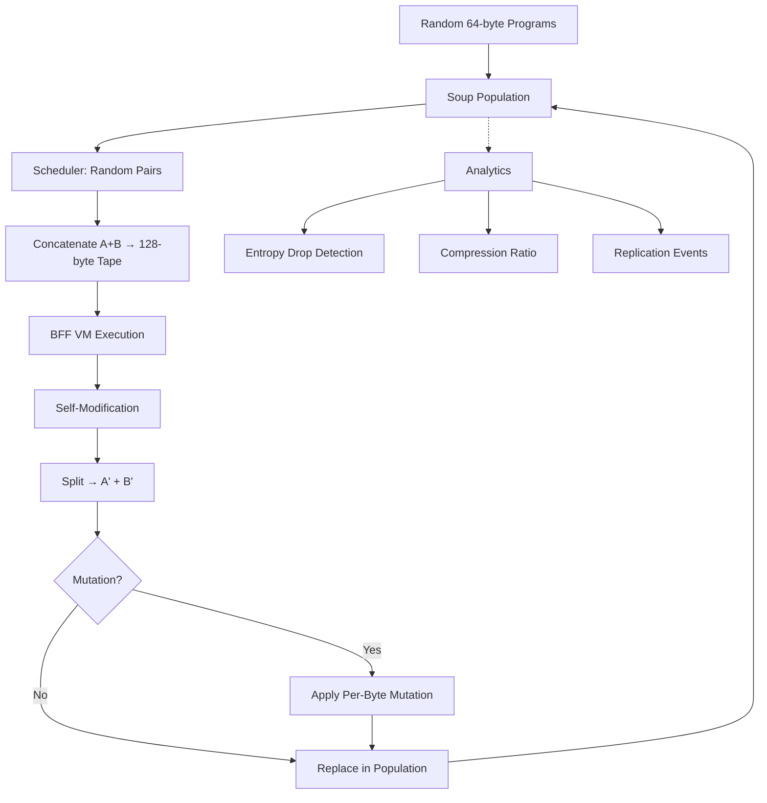

# Design Document - BFF VM Foundation (0.1.1)

## Overview

This design implements the core BFF (Brainfuck-variant) Virtual Machine that demonstrates digital abiogenesis - the emergence of self-replicating programs from random bytes. The implementation follows the canonical workflow documented in the original CuBFF research: random pairing → concatenation → execution → splitting → population update, repeated for millions of epochs until entropy drops and self-replicators emerge.

The design creates a Python package `bffx/` (BFF eXtended) that provides:
- Pure Python BFF VM with self-modification support
- Soup management for population evolution
- Analytics to detect the entropy drop
- Exact replication event detection
- Snapshot/restore for experiments
- CLI for running experiments

This is the foundational layer (0.1.1) that will later support the M|inc economic simulation (0.1.2+) where kings, knights, and mercenaries operate on top of these self-replicating programs.

## Architecture

### Module Structure

```
bffx/
├── __init__.py           # Package initialization
├── vm.py                 # Core BFF Virtual Machine
├── soup.py               # Population management and evolution
├── scheduler.py          # Pairing algorithms
├── analytics.py          # Entropy, compression, metrics
├── detectors.py          # Replication event detection
├── snapshot.py           # Population save/load
├── assay.py              # Replicator testing
└── cli.py                # Command-line interface
```

### Data Flow



## Components and Interfaces

### 1. BFF Virtual Machine (`vm.py`)

**Purpose**: Execute self-modifying BFF programs with precise halt conditions.

**Key Classes**:

```python
class HaltReason(Enum):
    STEP_LIMIT = auto()
    OOB_POINTER = auto()
    UNMATCHED_BRACKET = auto()
    PC_OOB = auto()
    NORMAL = auto()

@dataclass
class RunResult:
    tape: bytearray          # Final tape state (128 bytes)
    steps: int               # Instructions executed
    reason: HaltReason       # Why execution stopped
    oob_pointer: Optional[str]  # Which pointer went OOB
    unmatched_at: Optional[int] # PC where bracket failed

class BFFVM:
    def __init__(self, tape: bytearray, step_limit: int = 8192,
                 init_head0: int = 0, init_head1: int = 64)
    def run(self) -> RunResult
```

**Opcodes** (10 total, ~31/32 bytes are NO-OPs):
- `>` (0x3E): head0++
- `<` (0x3C): head0--
- `}` (0x7D): head1++
- `{` (0x7B): head1--
- `+` (0x2B): tape[head0]++
- `-` (0x2D): tape[head0]--
- `.` (0x2E): tape[head1] = tape[head0]
- `,` (0x2C): tape[head0] = tape[head1]
- `[` (0x5B): if tape[head0]==0 jump to ]
- `]` (0x5D): if tape[head0]!=0 jump to [

**Design Decisions**:
- Dynamic bracket matching (scan at runtime) to support self-modification
- Explicit halt reasons for debugging
- Unified 128-byte tape where code==data
- NO-OP treatment for unrecognized bytes (allows evolution from random bytes)

### 2. Soup Management (`soup.py`)

**Purpose**: Manage population evolution through the canonical workflow.

**Key Classes**:

```python
@dataclass
class PairOutcome:
    i: int                          # First program index
    j: int                          # Second program index
    order: str                      # "AB" or "BA"
    result: RunResult               # VM execution result
    replication_event: ReplicationEvent

class Soup:
    def __init__(self, size: int, rng: Optional[random.Random] = None)
    def epoch(self, scheduler: PairScheduler, 
              step_limit: int = 8192,
              mutation_p: float = 0.0,
              record_outcomes: bool = False) -> List[PairOutcome]
    def inject_mutation(self, per_byte_p: float) -> None
```

**Workflow per Epoch**:
1. Scheduler generates disjoint pairs: `[(i1,j1), (i2,j2), ...]`
2. For each pair (A, B):
   - Randomly choose AB or BA order
   - Concatenate → 128-byte tape
   - Execute with BFF VM
   - Split at byte 64 → A', B'
   - Apply mutation if enabled
   - Replace A→A', B→B' in population
3. Increment epoch counter
4. Return outcomes (optional)

**Design Decisions**:
- Random AB/BA order prevents positional bias
- Mutation applied AFTER split (not during execution)
- Optional outcome recording for analysis (memory vs. speed tradeoff)
- Pluggable scheduler for future spatial models

### 3. Scheduler (`scheduler.py`)

**Purpose**: Determine which programs interact each epoch.

**Interface**:

```python
PairScheduler = Callable[[int, random.Random], List[Tuple[int, int]]]

def random_disjoint_pairs(n: int, rng: random.Random) -> List[Tuple[int, int]]
```

**Design Decisions**:
- Simple function signature for extensibility
- Default: random disjoint pairing (every program interacts once per epoch)
- Future: spatial schedulers, preferential attachment, etc.

### 4. Analytics (`analytics.py`)

**Purpose**: Detect the entropy drop that signals emergence of self-replicators.

**Functions**:

```python
def shannon_entropy_bits(population: List[bytearray]) -> float
def compress_ratio(population: List[bytearray]) -> float
def opcode_histogram(population: List[bytearray]) -> Counter
def top_programs(population: List[bytearray], k: int = 5) -> List[Tuple[bytes, int]]
def hamming(a: bytes, b: bytes) -> int
```

**Key Metrics**:
- **Shannon Entropy**: High (~7-8 bits) for random soup, drops dramatically when replicators emerge
- **Compression Ratio**: Near 1.0 for random soup, increases (better compression) when structure emerges
- **Top Program Count**: Shows dominance of successful replicators

**Design Decisions**:
- Deterministic metrics (no randomness)
- zlib level 9 for compression (standard, reproducible)
- Byte-level entropy (not opcode-level) to capture full structure

### 5. Replication Detection (`detectors.py`)

**Purpose**: Identify exact self-replication events without heuristics.

**Classes**:

```python
@dataclass
class ReplicationEvent:
    kind: Literal["A_exact_replicator", "B_exact_replicator", "none"]
    A_before: bytes
    B_before: bytes
    A_after: bytes
    B_after: bytes

def detect_exact_replication(A_before: bytes, B_before: bytes,
                             A_after: bytes, B_after: bytes) -> ReplicationEvent
```

**Detection Logic**:
- **A_exact_replicator**: A' == A and B' == A (A copied itself to B)
- **B_exact_replicator**: A' == B and B' == B (B copied itself to A)
- **none**: Neither pattern matches

**Design Decisions**:
- NO thresholds, NO similarity scores, NO heuristics
- Exact byte-for-byte matching only
- Records full before/after state for analysis

### 6. Snapshot Management (`snapshot.py`)

**Purpose**: Save and restore population states for experiments.

**Functions**:

```python
def save_population_json_gz(path: str, population: List[bytearray], 
                            meta: Dict[str, Any] | None = None) -> None
def load_population_json_gz(path: str) -> tuple[list[bytearray], dict]
```

**Format**:
```json
{
  "meta": {
    "epoch": 1000,
    "seed": 42,
    "mutation_rate": 0.00005
  },
  "programs_hex": ["3e3e2b...", "5b2d5d...", ...]
}
```

**Design Decisions**:
- Compressed JSON (.json.gz) for portability
- Hex encoding for binary data
- Metadata for experiment tracking
- Validation on load (all programs must be 64 bytes)

### 7. Replicator Assay (`assay.py`)

**Purpose**: Test candidate replicators against random food programs.

**Function**:

```python
def assay_candidate(candidate: bytes,
                    foods: List[bytes],
                    trials: int = 100,
                    step_limit: int = 8192,
                    rng: random.Random | None = None) -> Tuple[int, int]
```

**Assay Protocol**:
1. For each trial:
   - Pick random food program F
   - Execute AB: candidate + F
   - Execute BA: F + candidate
   - Success if BOTH produce exact replication
2. Return (successes, total_trials)

**Design Decisions**:
- Tests BOTH orientations (AB and BA) for robustness
- Requires exact replication in both directions
- No partial credit or thresholds

### 8. Command-Line Interface (`cli.py`)

**Purpose**: Run experiments without writing code.

**Arguments**:
```bash
python -m bffx.cli \
  --pop 1024 \              # Population size (must be even)
  --epochs 10000 \          # Number of epochs to run
  --step-limit 8192 \       # Max instructions per interaction
  --mutate 0.00005 \        # Per-byte mutation probability
  --seed 42 \               # Random seed for reproducibility
  --report-every 100 \      # Report interval
  --log-events              # Track replication events
```

**Output**:
```
epoch    100 | top_count   1/1024 | compress_ratio 0.987 | shannon_bits 7.823
opcode_counts: >:0 <:0 +:0 -:0 {:0 }:0 .:0 ,:0 [:0 ]:0
epoch    200 | top_count   1/1024 | compress_ratio 0.985 | shannon_bits 7.801
...
epoch   5000 | top_count 512/1024 | compress_ratio 0.234 | shannon_bits 3.142
opcode_counts: >:12453 <:11892 +:8234 -:7891 {:234 }:198 .:15234 ,:14892 [:892 ]:891
exact_replication_events_this_epoch: 256
```

**Design Decisions**:
- Streaming output for long-running experiments
- Opcode histogram shows structure emergence
- Optional event logging (memory vs. insight tradeoff)

## Data Models

### Core Constants

```python
PROGRAM_SIZE = 64        # Bytes per program
TAPE_SIZE = 128          # Bytes per tape (2 programs)
DEFAULT_STEP_LIMIT = 8192  # Max instructions per interaction
```

### VM State

```python
# During execution
pc: int           # Program counter [0, 127]
head0: int        # First data pointer [0, 127]
head1: int        # Second data pointer [0, 127]
tape: bytearray   # 128 bytes (code==data)
steps: int        # Instructions executed
step_limit: int   # Max instructions allowed
```

### Population State

```python
# Soup state
pool: List[bytearray]  # Population of 64-byte programs
epoch_index: int       # Current epoch number
rng: random.Random     # Seeded RNG for reproducibility
```

## Error Handling

### VM Execution Errors

**Out-of-Bounds Pointers**:
- PC outside [0, 127] → halt with PC_OOB
- head0 outside [0, 127] → halt with OOB_POINTER (head0)
- head1 outside [0, 127] → halt with OOB_POINTER (head1)

**Unmatched Brackets**:
- `[` with no matching `]` → halt with UNMATCHED_BRACKET
- `]` with no matching `[` → halt with UNMATCHED_BRACKET
- Record PC where mismatch detected

**Step Limit**:
- Execution exceeds step_limit → halt with STEP_LIMIT
- Prevents infinite loops

### Population Errors

**Invalid Population Size**:
- Odd size → raise ValueError
- Size < 2 → raise ValueError

**Invalid Program Size**:
- Program != 64 bytes → raise ValueError (on load)

### Snapshot Errors

**Load Validation**:
- Missing programs_hex → raise KeyError
- Invalid hex → raise ValueError
- Wrong program size → raise ValueError

## Testing Strategy

### Unit Tests

**VM Tests** (`test_vm.py`):
- Test each opcode individually
- Test halt conditions (OOB, brackets, step limit)
- Test dynamic bracket matching with self-modification
- Test NO-OP handling

**Soup Tests** (`test_soup.py`):
- Test initialization (random programs)
- Test epoch workflow (pair → execute → split)
- Test mutation application
- Test outcome recording

**Analytics Tests** (`test_analytics.py`):
- Test entropy calculation (known distributions)
- Test compression ratio (random vs. structured)
- Test opcode histogram
- Test Hamming distance

**Detector Tests** (`test_detectors.py`):
- Test A_exact_replicator detection
- Test B_exact_replicator detection
- Test "none" classification
- Test edge cases (partial replication)

**Snapshot Tests** (`test_snapshot.py`):
- Test save/load round-trip
- Test metadata preservation
- Test validation on load

### Integration Tests

**Emergence Test** (`test_emergence.py`):
- Run small soup (128 programs) for 1000 epochs
- Verify entropy drops over time
- Verify compression ratio increases
- Verify replication events occur

**Reproducibility Test** (`test_reproducibility.py`):
- Run same experiment with same seed twice
- Verify identical results (byte-for-byte)

**Assay Test** (`test_assay.py`):
- Test known replicator against random foods
- Verify high success rate
- Test non-replicator (low success rate)

### Performance Tests

**Throughput Test**:
- Measure epochs/second for various population sizes
- Target: 1024 programs, 100 epochs/second on modern hardware

**Memory Test**:
- Verify linear memory scaling with population size
- No memory leaks over long runs

## Performance Considerations

### Optimization Strategies

**VM Execution**:
- Fast path for NO-OPs (most common case)
- Inline bounds checks
- Avoid unnecessary allocations

**Soup Evolution**:
- Pre-allocate next generation array
- Minimize copying (use bytearray, not bytes)
- Optional outcome recording (memory vs. insight)

**Analytics**:
- Compute metrics on-demand (not every epoch)
- Use efficient Counter for histograms
- Stream output (don't accumulate in memory)

### Scalability

**Population Size**:
- Tested up to 128K programs
- Linear memory scaling: ~8MB per 128K programs
- Linear time scaling: O(n) per epoch

**Epoch Count**:
- Tested up to 100K epochs
- Constant memory (no history accumulation)
- Streaming output for long runs

## Integration with M|inc Economic Layer (Future)

### Design for Extension

**Agent Association**:
- Future: Each program can be associated with an agent (king, knight, mercenary)
- Current: Programs are anonymous (just bytes)

**Economic Events**:
- Future: Replication events trigger economic transfers (wealth, currency)
- Current: Replication events are just logged

**Trait Mapping**:
- Future: Program bytes map to agent traits (raid, defend, sense, etc.)
- Current: No trait interpretation

**Interaction Rules**:
- Future: Pairing influenced by economic incentives (bribes, retainers)
- Current: Random pairing only

### Separation of Concerns

**BFF VM Layer (0.1.1)** - This spec:
- Pure evolutionary dynamics
- Self-replication emergence
- No economic concepts

**M|inc Economic Layer (0.1.2+)** - Future spec:
- Kings, knights, mercenaries
- Wealth, currency, traits
- Bribes, raids, defends
- Built ON TOP of BFF VM

## Determinism and Reproducibility

### Seeded Randomness

**All randomness uses seeded RNG**:
- Soup initialization: `rng = random.Random(seed)`
- Pairing: `rng.shuffle(idx)`
- AB/BA order: `rng.random() < 0.5`
- Mutation: `rng.getrandbits(8)`

**Same seed → identical results**:
- Byte-for-byte identical populations
- Identical entropy curves
- Identical replication events

### Deterministic Execution

**VM execution is deterministic**:
- No randomness in opcode execution
- Dynamic bracket matching is deterministic
- Halt conditions are deterministic

**Analytics are deterministic**:
- Entropy calculation is deterministic
- Compression is deterministic (zlib level 9)
- Histograms are deterministic

## Migration from 0.1.0

### What's Preserved

**Core Concepts**:
- Digital abiogenesis (life from random bytes)
- Purpose emerging through reproduction
- Entropy drop as emergence signal
- 10-opcode BFF language
- Unified 128-byte tape (code==data)

**Workflow**:
- Random pairing → concatenate → execute → split
- Millions of epochs until emergence
- Self-modification during execution

### What's New in 0.1.1

**Module Organization**:
- Clean Python package structure (`bffx/`)
- Separated concerns (vm, soup, analytics, etc.)
- Documented interfaces

**Exact Replication Detection**:
- No thresholds or heuristics
- Records full before/after state

**Snapshot/Restore**:
- Portable JSON format
- Metadata support

**Replicator Assay**:
- Systematic testing protocol
- Both AB and BA orientations

**CLI**:
- Easy experimentation
- Streaming output
- Reproducible with seeds

### What's Coming in 0.1.2+

**M|inc Economic Layer**:
- Kings, knights, mercenaries
- Wealth, currency, traits
- Bribes, raids, defends
- Economic incentives on top of evolution

---

*This design provides the foundation for digital abiogenesis experiments and future M|inc economic simulations.*
