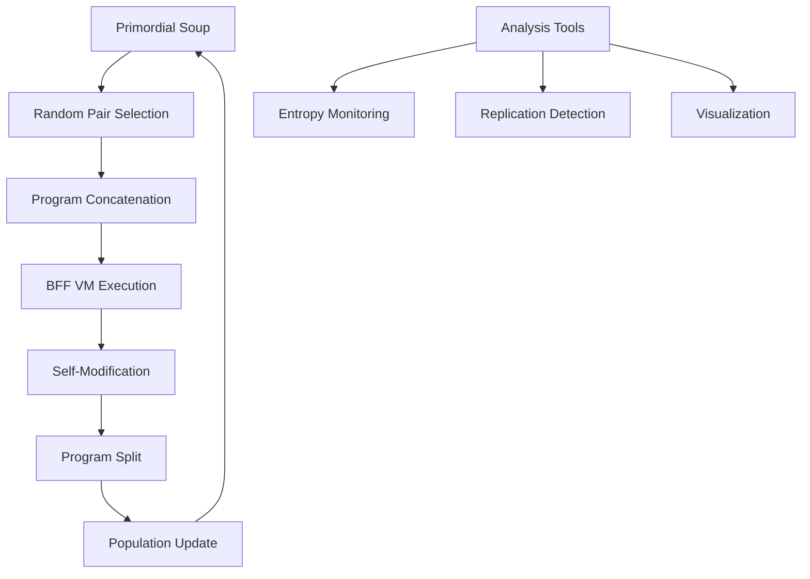
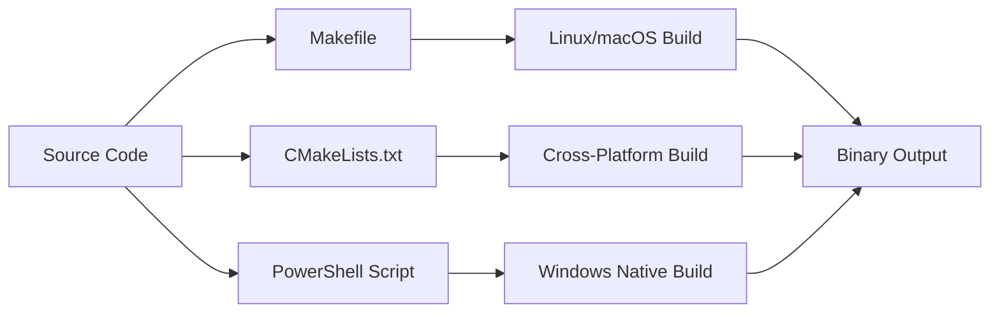

# CuBFF Architecture Overview - (DEPRECIATED:"0.1.0") ==> (MIGRATED:"0.1.1")

The CuBFF architecture implements a self-modifying computational environment where programs can evolve and self-replicate through random interactions. This document provides a comprehensive overview of the system architecture and design principles.

## Quick Navigation

- [Core Concepts](core_concepts.md) - BFF fundamentals and execution model
- [Implementation Details](implementation/) - Technical implementation specifics
- [m.inc Extensions](extensions/) - Mercenaries Incorporated enhancements
- [Research Background](research/) - Academic papers and theoretical foundation

## System Architecture

### High-Level Design

### Core Components

#### 1. Virtual Machine (`common.h`, `common.cc`)
- Purpose: Executes BFF programs with self-modification capabilities
- Key Features:
    - Unified 128-byte tape (code + data)
    - Three-pointer system (PC, head0, head1)
    - 10-instruction BFF language
    - Self-modification support

#### 2. Language Implementations (`*.cu` files)
- BFF Variants: `bff.cu`, `bff_noheads.cu`, `bff8.cu`
- Alternative Languages: `forth.cu`, `subleq.cu`, `rsubleq4.cu`
- Purpose: Different computational substrates for evolution experiments

#### 3. Python Interface (`python/bff_interpreter.py`)
- Pure Python Implementation: Complete BFF interpreter
- Analysis Tools: Soup analysis, replication detection, visualization
- API Compatibility: Matches C++ implementation behavior

#### 4. Build System Integration
- Makefile: Primary build system with CUDA support
- CMakeLists.txt: Cross-platform CMake configuration
- PowerShell: Windows-specific build automation

## Execution Model

### BFF Language Design

The BFF (Brainfuck Forth) language extends traditional Brainfuck with:

1. Unified Memory Model: Code and data share the same 128-byte tape
2. Dual Head System: Two independent data pointers (head0, head1)
3. Self-Modification: Programs can modify their own code during execution
4. Copy Operations: Internal data transfer replaces I/O operations

### Instruction Set

| Instruction | Byte Value | Operation | Description |
|-------------|------------|-----------|-------------|
| `>` | 0x3E | head0++ | Move read head right |
| `<` | 0x3C | head0-- | Move read head left |
| `}` | 0x7D | head1++ | Move write head right |
| `{` | 0x7B | head1-- | Move write head left |
| `+` | 0x2B | tape[head0]++ | Increment byte at head0 |
| `-` | 0x2D | tape[head0]-- | Decrement byte at head0 |
| `.` | 0x2E | tape[head1] = tape[head0] | Copy head0 to head1 |
| `,` | 0x2C | tape[head0] = tape[head1] | Copy head1 to head0 |
| `[` | 0x5B | if tape[head0]==0 jump to ] | Loop start |
| `]` | 0x5D | if tape[head0]!=0 jump to [ | Loop end |

### Execution Cycle

1. Pair Selection: Random selection of two 64-byte programs
2. Concatenation: Combine into single 128-byte tape
3. Initialization: Set PC=0, head0=0, head1=64
4. Execution: Run BFF interpreter with step limit
5. Split: Separate back into two 64-byte programs
6. Update: Replace original programs in population

## Self-Replication Mechanism

### Emergence Process

1. Random Phase: Most interactions produce no meaningful changes
2. Mutation Phase: Occasional beneficial mutations occur
3. Selection Phase: Self-replicating programs gain advantage
4. Dominance Phase: Replicators spread through population

### Replication Detection

The system detects self-replication through:
- Exact Matching: Programs that produce identical copies
- Entropy Analysis: Drop in population entropy indicates structure
- Compression Ratio: Increased compressibility signals replication

## Cross-Platform Architecture

### Build System Integration

### Platform-Specific Considerations

- Windows: WSL2 support, native Windows builds, PowerShell automation
- macOS: CUDA disabled by default, OpenMP integration
- Linux: Full CUDA support, standard Unix build process

## Performance Characteristics

### Parallelization Strategy

- GPU Acceleration: CUDA kernels for parallel program execution
- CPU Fallback: Multi-threaded execution when CUDA unavailable
- Memory Management: Efficient tape representation and copying

### Scalability

- Population Size: Supports 128K+ programs
- Execution Speed: ~3×10⁹ instructions/second on high-end hardware
- Memory Usage: Linear scaling with population size

## m.inc Enhancements

### Documentation Architecture

- AI Agent Optimization: Structured metadata and cross-references
- Cross-Platform Coverage: Unified documentation across platforms
- Source Code Integration: Direct links to implementation details

### Analysis Tools

- Enhanced Visualization: Improved web-based visualization tools
- Replication Detection: More sophisticated analysis algorithms
- Performance Monitoring: Real-time metrics and statistics

## Research Foundation

The CuBFF implementation is based on:

- Agüera y Arcas et al. (2024): "Computational Life: How Well-formed, Self-replicating Programs Emerge from Simple Interaction"
- Blaise Agüera y Arcas: Nautilus article on digital abiogenesis
- CuBFF Repository: Open-source implementation by Google Paradigms of Intelligence

## Future Extensions

### Planned Enhancements

1. Additional Languages: More computational substrates
2. Spatial Models: 2D/3D interaction patterns
3. Network Effects: Program communication protocols
4. Machine Learning: AI-assisted analysis and optimization

### Research Directions

- Complexity Metrics: Better measures of program sophistication
- Evolutionary Dynamics: Understanding selection pressures
- Emergence Patterns: Predicting replication events

---

*This architecture overview provides the foundation for understanding CuBFF's design and implementation. For detailed technical specifications, see the [Implementation Details](implementation/) section.*
